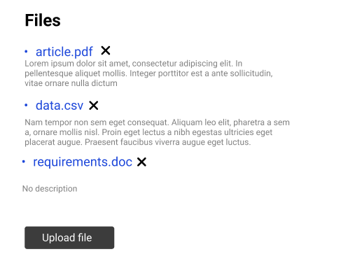
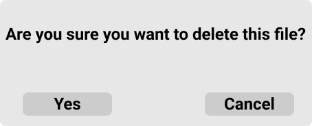

# Files

## Accessing files view

You can access files view by clicking the **"Files"** option at the drop down menu:

This will transfer you to the files view:

## Adding files

1. Click on the **upload files"** button
2. This will pop up dialog with file to chose
3. Click on the correct file
4. Upload it to your project

## Adding descritpion to your files

1. Click on the **"No description"** field
2. This will enable you to add desired description
3. Click away after adding descritpion to your file

## Deleting files

1. Click on the button to the right side of added file
2. After this the confirmation dialog will pop up:            

3. Click on **"Yes"** if you want to delete selected file from your inventory 
4. Click **"Cancel"** if you want to cease the operation
