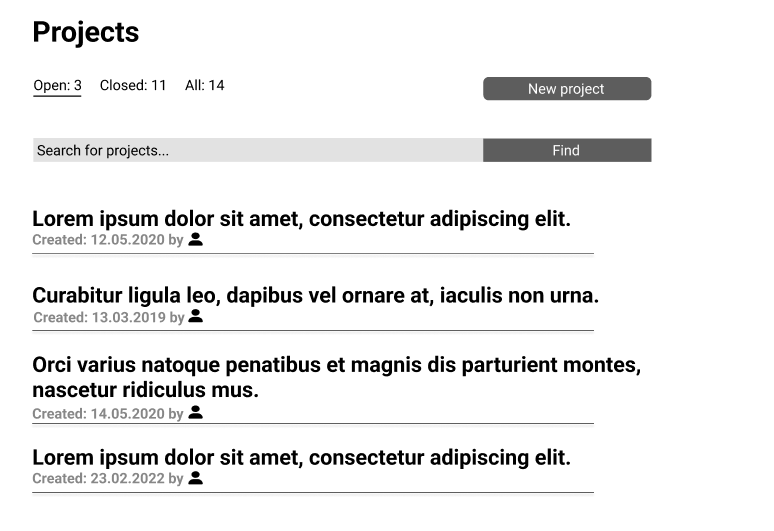
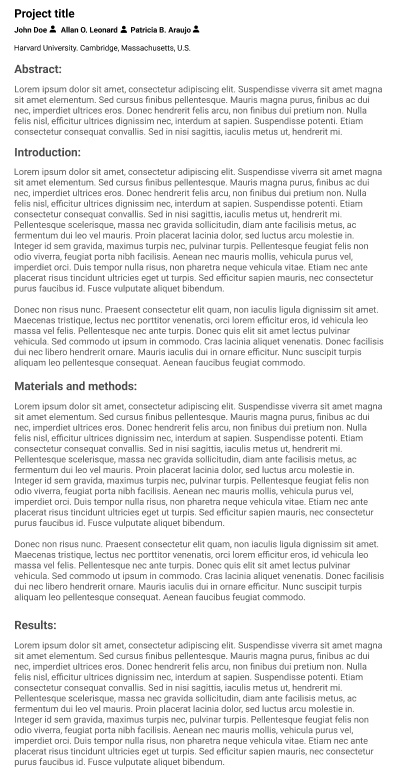

# Project

## Starting a new project

1. If you want to start a new project click on the **"Projects"** option in drop down menu:

2. This will transfer you to the list of projects:

4. Click on the **"New project"** in the right corner
5. This will transfer you to the page with new project display:

6. Fill in the information about your project
7. Add **"Figures"** and **"Additional files"** on the bottom of the page
8. If you want to see your project preview click on the **"Profile preview"** button below
9. If you want to cease the operation click on **"Cancel"** button
10. If you want to start your project click on the **"Start project"** button

## Project view

If you want to access specific project view:

1. Click on the specific **project title** on the **projects list page**
2. This will transfer you to the projects' page:

