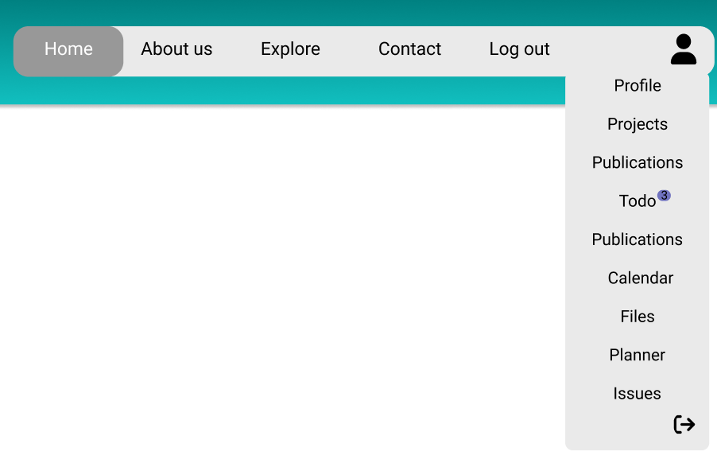
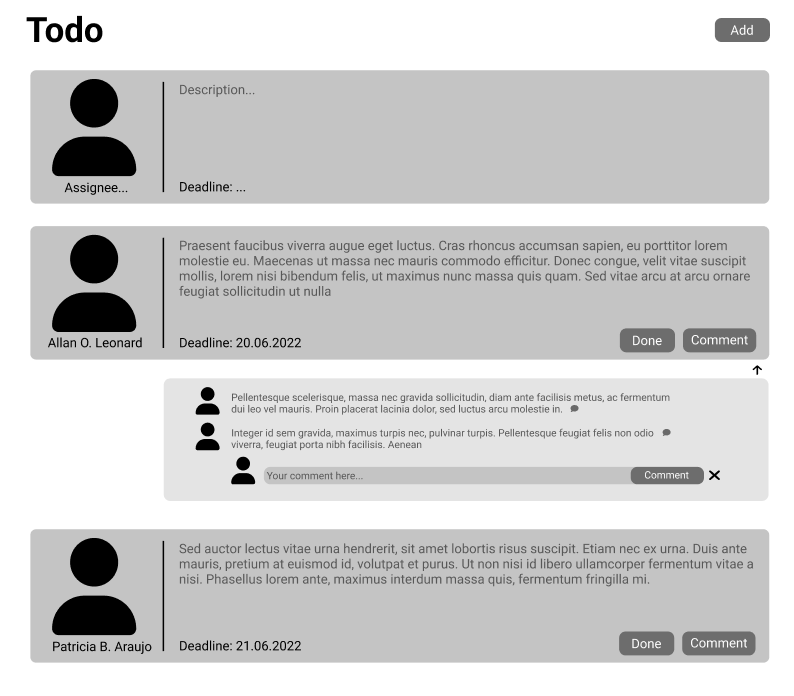

# Todo

## Accessing todo view

If you want to access the planner view click on the **"Todo"** option on drop down menu:

This will transfer you to the planner view:

## Navigation on todo page

1. If you want to add new todo click on the **"Add"** button
2. If you want to comment certain todo click on the **"Comment"** button in the down right corner
3. If you want to mark certain todo as finished click on the **"Done"** button - this will end the task and delete card from the list
4. If you want to show/collapse responses to comment use the black arrow button beneath the comment with responses

## Adding new todo

You can create a new todo in two ways:

1. You can add new todo simply by pinging member of your project in issue, preceding him/her name with **@** sign. Ths will automatically create new todo card with the content of comment/issue descirpition. 
2. You can also click on the **"Add"** button. This will create empty card with information to fill in:

Now you have to assign this task to a new person, sepcify the description and add deadline. 
