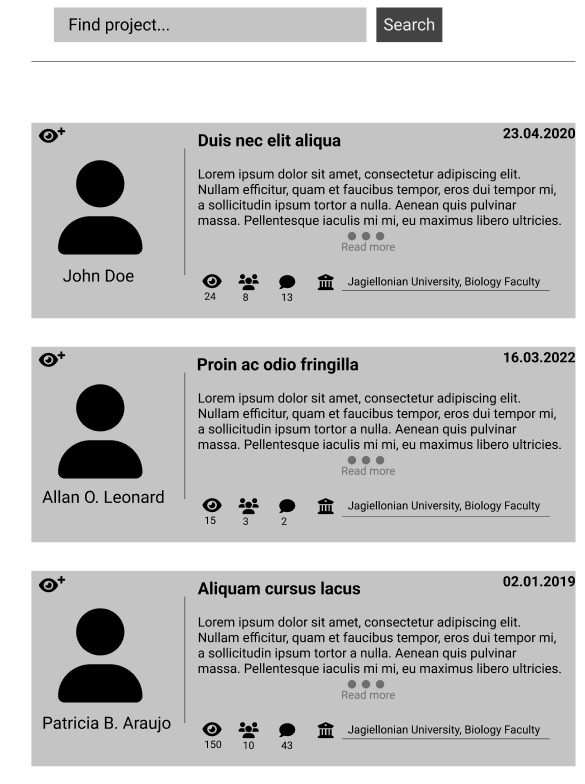
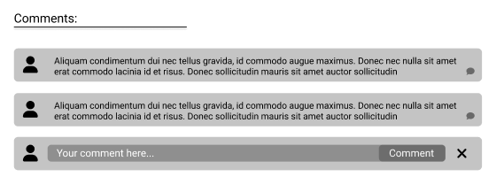

# Explore

## Accessing exlpore page

If you want to access the planner view click on the **"Explore"** option on drop down menu:

This will transfer you to the Explore page:

## Information on explore page

1. At the top of the page is search bar where you can type project name and find it by clicking **"Search"** button.
1. At the top of the project card is its title
2. Below the title there is an description of the project - in order to read all the descrtiption click on the **"Read more"** button - this will expand text of the descritpion 
3.  icon shows the number of followers of the project. After clicking on it you can expand the list of users following the project and go to their profiles by clicking on their names:

- You can click on 3 dots beneath the last name and surname to see full list of scientsts:

- Click away for this dialog to disapear.

4. You can click on the  button in order to follow the project - you will receive information regarding major changes in project on your email.

5.  icon shows what institution is responsible for the project
6.  icon shows the number of scientists working on certain project. After clicking on it you can expand the list of scientists and go to their profiles by clicking on their names:

- You can click on 3 dots beneath the last name and surname to see full list of scientsts:

- Click away for this dialog to disapear.

7.  icon shows number of comments added to this project. After clicking on it you can expand the list of comments, respond to them and add your own comment:

