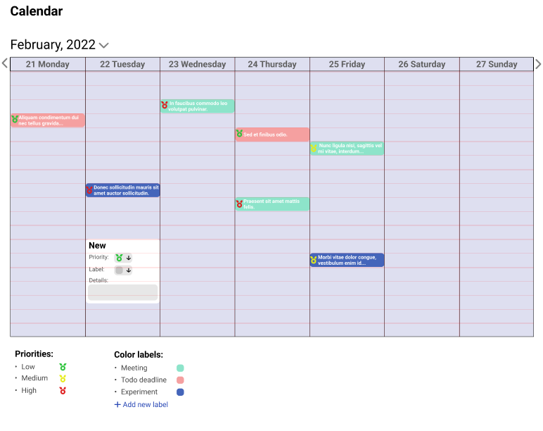
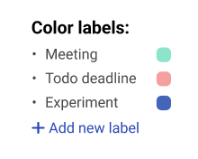

# Calendar

## Accessing calendar

You can access your calendar by simply clicking on **"Calendar"** button in drop down menu:

This will transfer you to the page with your calendar, with events marked on it:

## Basic navigation

1. You can pick the year, month and a day dropping down menu near the date above the calendar
2. You can change the week view by clicking the pointers on the left and right side of calendar
3. By clicking on the event that's already in your calendar you can view more details 

## Your calendar events

1. I you want to add new event, click on the **calendar in the selected time** - this will result in new dialog appearing on the screen:  

2. Add title to your event by click on **"New"** 
3. Change priority level of your event by clicking **"Priority"**
4. Change label of your event by clicking **"Label"**
5. Add some details by filling up the **"Details"** section
6. If you have finished defining your event the just click away - now your event is saved!

## Adding labels

1. If you want to add new label to your inventory click on **"Add new label"** below the list of predifined labels:

2. This will pop up new dialog where you can define your own label:  

3. Add title to your label by clicking in the **"Label title"** field
4. Add description - an information of what your label actually means
5. Add unique color to your label by dropping the **"Color"** menu and choosing the right color from palette. 
6. Click away and now your label is saved and ready to used!
