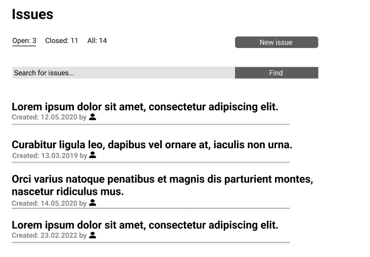

# Issues

## Accessing issues view

If you want to access issue view you have to click on **"Issues"** option in headers' drop down menu:

This will transfer you to the issues view:

## Basic navigation on issues list

1. You can change filtering (open, closed, all) by switching between different options at the top of the Issues page 
2. Is you want to search for the specific issue you can type in the name in the **"Search for issues..."** field and clicking **""Find"** button
3. If you want to go to the specific issue just click on its name on the list - this action will transfer you to the specific issue you requested

## Starting new issue

1. Click on the **"New issue"** button
2. This will transfer you to the new issue view:
    
3. Add title by click on the **"Title"** field
4. Add descirpition by clicking on the text field below the **"Description"** label
5. Add labels to your issue by dropping down menu near the **"Label"** field
6. Add contributors to your issue by filling up their names or email addresses near the **"Contributors"** label
7. Click **"Create issue"** to start a new issue
8. Click **"Cancel"** if you want to cease the operation

## Basic navigation on single issue view

