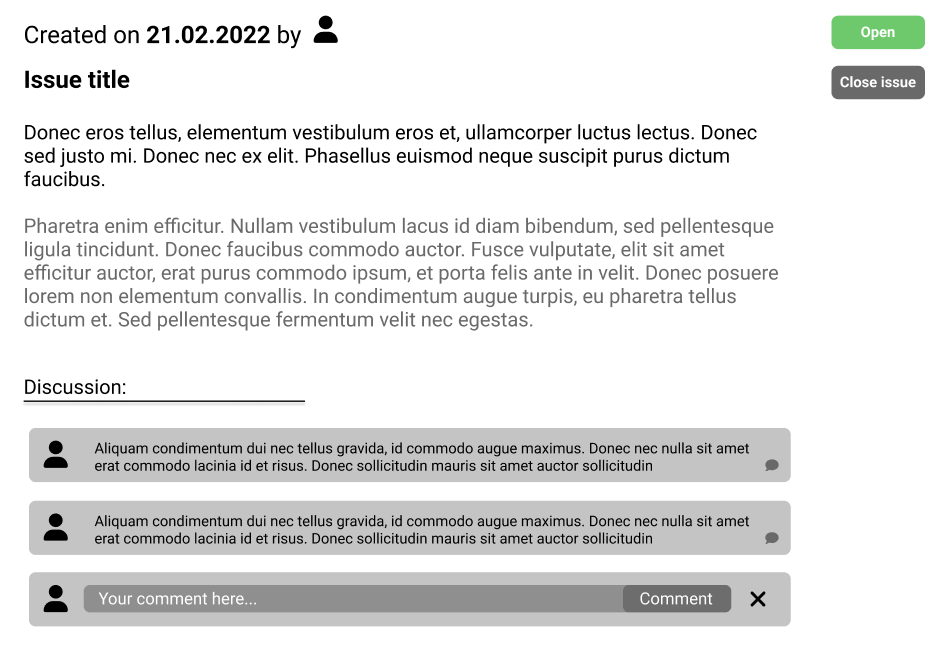
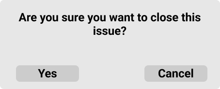

# Issues

## Accessing issues view

If you want to access issue view you have to click on **"Issues"** option in headers' drop down menu:

This will transfer you to the issues view:

## Basic navigation on issues list

1. You can change filtering (open, closed, all) by switching between different options at the top of the Issues page 
2. Is you want to search for the specific issue you can type in the name in the **"Search for issues..."** field and clicking **""Find"** button
3. If you want to go to the specific issue just click on its name on the list - this action will transfer you to the specific issue you requested

## Starting new issue

1. Click on the **"New issue"** button
2. This will transfer you to the new issue view:  
    
3. Add title by click on the **"Title"** field
4. Add descirpition by clicking on the text field below the **"Description"** label
5. Add labels to your issue by dropping down menu near the **"Label"** field
6. Add contributors to your issue by filling up their names or email addresses near the **"Contributors"** label
7. Click **"Create issue"** to start a new issue
8. Click **"Cancel"** if you want to cease the operation

## Basic navigation on single issue view

After creating your own issue you have now access to all its contents. Also the contributors whom you have mentioned during setting up the issue are notified on their emails about it. So let's dive into navigation on your own issue:

1. On the right corner there is an information about the current status of the issue (**"Open"** in this example) 
2. On the left corner there is an information about created date and title below
3. Below the title there is an description that you provided for your issue
4. After clicking the **"Edit"** button you'll be able to modify title or description
5. Below the description there is an discussion concerning this issue - click on the **"Your comment here"** label in order to leave the comment. After adding the comment just click away so it would save. If you want to cancel commenting click the  button.
6. If you want to refer to the specific comment then click on the  button attached to every comment - this will let you answer in the thread of one comment
7. If you want to close the issue click on the **"Close issue"** button. This action will pop up a dialog:

8. Click **"Yes"** to confirm closing the issue, click **"Cancel"** to stop the process. 
