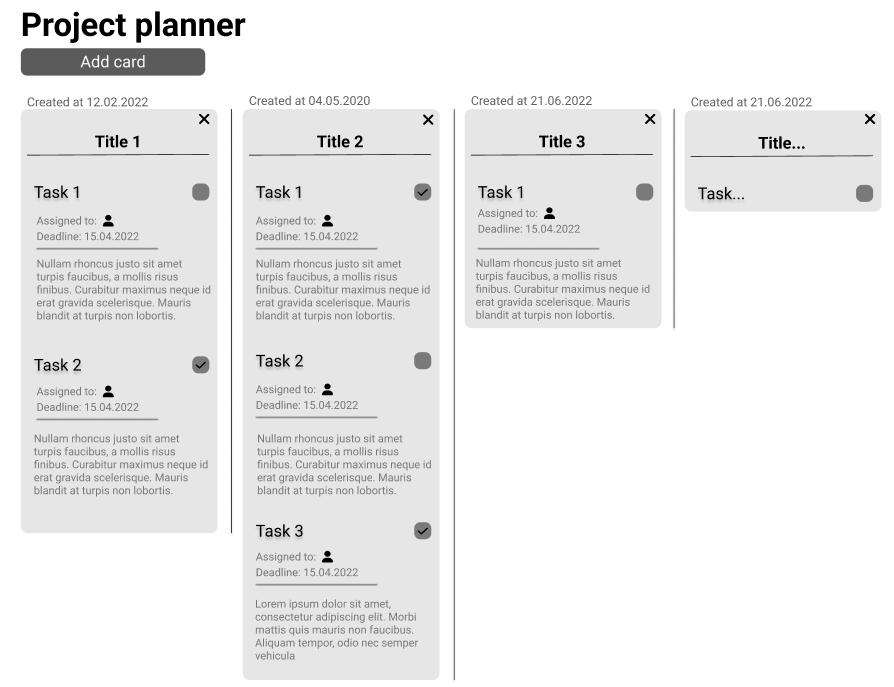
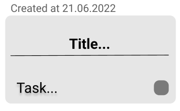
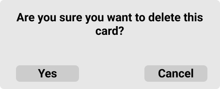

# Planner

## Accessing planner view

If you want to access the planner view click on the **"Planner"** option on drop down menu:

This will transfer you to the planner view:

## Adding new card

1. If you want to add new card with plans to your planner click on the **"Add card"** button
2. It will prompt new blank card to the view:

## Editting card

1. In order to change the title click on the **"Title"** label
2. If you want to add the task click on the **"Task"** label - this will enable you to add the title of the task and necessary description
3. If you want to inform others that certain task is finished then click on the checkbox near the task title. To restore the task click on the label again
4. After finishing whole card you can click on the 
icon. This will prompt dialog with confirmation:

5. Click **"Yes"** to confirm. Click **"Cancel"** to cease the operation.
